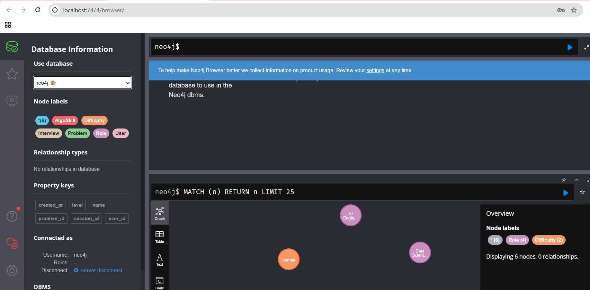

1. .env에
```
NEO4J_AUTH=neo4j/gyulcross0113
ELASTIC_PASSWORD=gyulcross0113
KIBANA_PASSWORD=gyulcross0113
```
값 먼저 추가한다.


2. 
```
 docker-compose -f docker/docker-compose.yml --env-file .env up -d   
```
 로 먼저 docker 실행 up 해줌

```
 docker compose -f docker/docker-compose.yml --env-file .env up -d setup
```

이거로 setup 별도 실행 후 
```
docker compose -f docker/docker-compose.yml --env-file .env exec neo4j cypher-shell -u neo4j -p gyulcross0113 -f /var/lib/neo4j/import/schema.cypher
```
로 Neo4j Schema적용함

그럼 실제로 localhost:7474에서 .env에 적힌 계정 값으로 입력 후 로그인 하면 

사진과 같이 확인 가능


3. 인덱스 생성(*혹시몰라서 해야함)
```
curl.exe -u elastic:gyulcross0113 -X PUT "http://localhost:9200/coding_problem" -H "Content-Type: application/json" --data-binary "@docker/elasticsearch/coding_problem_mapping.json"
```

4. csv를 Neo4j import에 복사
```
powershell -ExecutionPolicy Bypass -File docker/scripts/sync_neo4j_import.ps1
```

5. Neo4j 문제 로드
```
docker compose -f docker/docker-compose.yml --env-file .env exec neo4j cypher-shell -u neo4j -p gyulcross0113 -f /var/lib/neo4j/import/load_coding_problems.cypher
```

6. ES 인덱싱 진행
```
python docker/scripts/index_coding_problems_es.py --es-password gyulcross0113
```

> Done이 뜨면 된거

7. 임베딩 확인
```
$body = @{ query = @{ match_all = @{} }; _source = @("embedding") } | ConvertTo-Json -Compress
Invoke-RestMethod -Method Post -Uri "http://localhost:9200/coding_problem/_search?size=1" -Headers @{Authorization=("Basic " + [Convert]::ToBase64String([Text.Encoding]::UTF8.GetBytes("elastic:gyulcross0113")))} -ContentType "application/json" -Body $body
```

7-1. 임베딩 필드 값 확인

```
$body = @{ query = @{ match_all = @{} }; _source = @("embedding") } | ConvertTo-Json -Compress
$res = Invoke-RestMethod -Method Post -Uri "http://localhost:9200/coding_problem/_search?size=1" -Headers @{Authorization=("Basic " + [Convert]::ToBase64String([Text.Encoding]::UTF8.GetBytes("elastic:gyulcross0113")))} -ContentType "application/json" -Body $body
$res.hits.hits[0]._source.embedding
```

MATCH (n) RETURN n LIMIT 25
