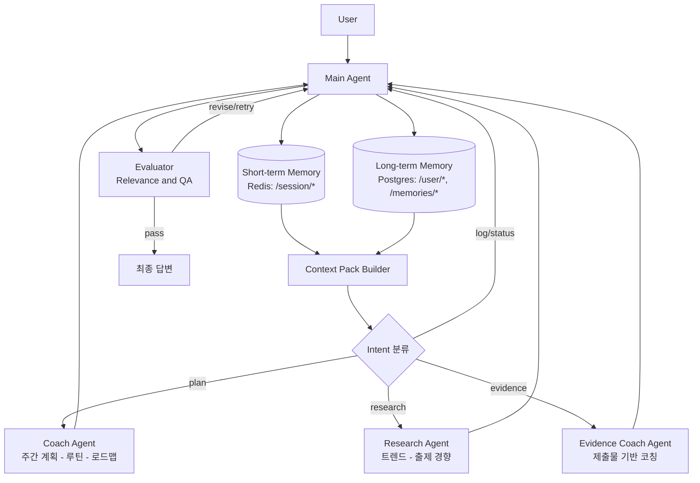

# deep agent 설계

## 초기 방안
1. STEP3에서 평가 리포트를 도출하고 그에 따른 부족한 부분 영상추천 혹은 공부계획 만들어주기 (주영님)
2. AI 면접관이 질문을 잘 했는지 잘 평가했는지 면접관을 평가하는 에이전트 (규리님)
3. 코드 리뷰 시스템 (준규님)
4. 사용자별 맞춤형 성장 로드맵 생성(새로운 서비스 도입) - 채린님
5. 문제 난이도 자동 재보정

==> 두가지의 방식으로 설계해볼 수 있다.
- 유저용(실시간): 취준생용 개발자 취업 코치
- 관리자용(비동기/배치): 면접관 품질 평가 → 프롬프트/룰/그래프 튜닝, 문제 난이도 재보정 → 문제은행 메타 업데이트

## 1. 취준생용 개발자 취업 코치

### 기능
*목표 기반 로드맵*
: 희망 직무·회사·마감일·코딩테스트 수준을 기준으로 이번 주 반드시 해야 할 행동을 고정한다.

*증거 기반 코칭*
: 사용자가 준 ‘증거(artifact)’를 입력으로 받아서 → 요약/평가/개선 액션을 돌려주는 코칭 엔진

*맞춤형 리서치*
: 직무 × 시기 × 시장 흐름 × 기술 이슈를 분석해, 정보를 요약하는 데서 끝내지 않고 구체적인 액션으로 변환한다.

*진척 추적 (Outcome 중심)*
: To-do 체크가 아니라 결과물(Outcome) 기준으로 성장과 진척을 추적한다.
(예: PR 2개, 블로그 1편, 코딩테스트 3문제)

### 설계
- 전체 구조

   - Main Agent(Deep Agent)
      - 입력 의도 분류
      - 상태 로드
      - Sub Agent 호출(Coach Agent/ Research Agent / Evidence Coach Agent)

   - Evaluator(Relevance/QA) : Maing Agent에서 나온 결과물 검증

### 세부 설계 (Main Agent)

- Profile, Behavior, Evidence 기반 (개인화된 서비스)
- CompositeBackend : 저장관련
   - StoreBackend(namespace를 통해 데이터 분리)

####  메모리 설계
- Redis (short-term, TTL 적용)
   - `chatsession/{sid}/runtime` (Hash/JSON, TTL=세션) : 현재 세션의 상태 스냅샷(user_id, active_intent, evidence_type, stage, retry_count, last_verdict, updated_at).
   - `chatsession/{sid}/recent_msgs` (List, TTL=세션) : 최근 N턴(예: 5~10턴) 대화 로그. `LPUSH + LTRIM`으로 길이 제한.
   - `chatsession/{sid}/dialog_summary` (String/JSON, TTL=세션) : 최근 대화 요약/핵심 포인트. 컨텍스트 패킹 시 사용.
   - `chatsession/{sid}/working_set/{item_id}` (Hash/JSON, TTL=세션) : 현재 처리 중 입력(아티팩트) 단위 저장.
      - type: code/problem/video/doc/link/text
      - raw: 원본(필요 시)
      - normalized: 정규화 결과(파싱된 문제 텍스트, 코드 언어/함수, transcript 등)
      - status: parsed/ready/transcribed/error
      - source: url/file/paste
      - hash: 동일 입력 중복 처리 방지용(선택)

- Postgres (Long-Term)
   - `/user/*` : 구조화된 사실·성과·계획
      - `/user/profile` : user_id, role(직무), target_company, due_date, skill_level, preferred_langs, created_at, updated_at
      - `/user/weekly_plan/{week_id}` : user_id, week_id, goals(JSON), routines(list), focus_areas, status(active/done), updated_at
      - `/user/research_briefs` : user_id, brief_id, topic, summary, actions(list), sources(list), created_at
      - `/user/next_actions` : user_id, action_id, title, description, due, priority, status(todo/doing/done), created_at, updated_at
      - `/user/outcome_logs` : user_id, outcome_id, kind(PR/blog/ct 등), summary, link, score(optional), created_at
      - `/user/coaching_logs` : user_id, coaching_id, artifact_id, findings, recommendations, rubric_scores(JSON), created_at
      - **코딩테스트 리포트 활용** : outcome_logs/coaching_logs에 점수·오답 패턴·시간 분배를 저장 → weekly_plan/next_actions 생성 시 약점별 액션으로 반영

   - `/memories/*` : 요약·특성·패턴
      - `/memories/traits` : user_id, strengths(list), weaknesses(list), patterns(list), confidence, updated_at
         - **코딩테스트 리포트 연동** : 반복되는 취약 유형(알고리즘/구현 실수)을 기록해 답변·과제 난이도 조정에 사용
      - `/memories/preferences` : user_id, tone_pref, detail_level, feedback_style, updated_at

### 툴 정의 (초안)
- 공통
   - `memory.load_session(user_id, session_id)` : Redis/DB에서 프로필·대화·요약 로드
   - `memory.save_session(...)` : runtime/recent_msgs/dialog_summary/working_set 갱신

- Coach Agent
   - `calendar.upsert_event(title, due, tags)` : 마감/주요 일정 등록
   - `tasks.create_plan(goals, routines, focus)` : 주간/일간 계획 생성
   - `tasks.update_status(action_id, status)` : 태스크 상태 갱신

- Research Agent
   - `web.search(query, top_k)` : 웹/RSS/뉴스 검색
   - `web.summarize(urls)` : 링크 요약 + 핵심 포인트 추출
   - `trend.briefs(topic)` : 트렌드/출제 경향 요약 → 액션 제안

- Evidence Coach Agent
   - `artifact.parse(file_or_url, type)` : PDF/DOCX/텍스트/코드 파싱
   - `artifact.score(rubric)` : 루브릭 기반 평가/점수화
   - `artifact.suggest_fix(findings)` : 개선/수정 제안 생성

- Evaluator
   - `eval.validate_format(payload)` : JSON/스키마 검사
   - `eval.safety_guard(text)` : 안전/정책 위반 필터
   - `eval.check_relevance(query, answer)` : 의도 대비 관련성 점검

