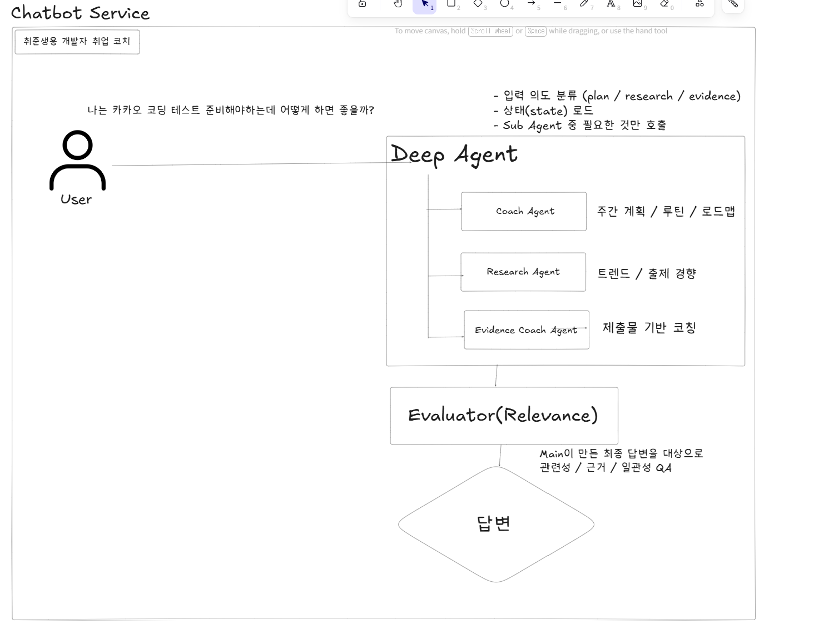

# deep agent 설계

## 초기 방안
1. STEP3에서 평가 리포트를 도출하고 그에 따른 부족한 부분 영상추천 혹은 공부계획 만들어주기 (주영님)
2. AI 면접관이 질문을 잘 했는지 잘 평가했는지 면접관을 평가하는 에이전트 (규리님)
3. 코드 리뷰 시스템 (준규님)
4. 사용자별 맞춤형 성장 로드맵 생성(새로운 서비스 도입) - 채린님
5. 문제 난이도 자동 재보정

==> 두가지의 방식으로 설계해볼 수 있다.
- 유저용(실시간): 취준생용 개발자 취업 코치
- 관리자용(비동기/배치): 면접관 품질 평가 → 프롬프트/룰/그래프 튜닝, 문제 난이도 재보정 → 문제은행 메타 업데이트

## 1. 취준생용 개발자 취업 코치

### 기능
*목표 기반 로드맵*
: 희망 직무·회사·마감일·코딩테스트 수준을 기준으로 이번 주 반드시 해야 할 행동을 고정한다.

*증거 기반 코칭*
: 사용자가 준 ‘증거(artifact)’를 입력으로 받아서 → 요약/평가/개선 액션을 돌려주는 코칭 엔진

*맞춤형 리서치*
: 직무 × 시기 × 시장 흐름 × 기술 이슈를 분석해, 정보를 요약하는 데서 끝내지 않고 구체적인 액션으로 변환한다.

*진척 추적 (Outcome 중심)*
: To-do 체크가 아니라 결과물(Outcome) 기준으로 성장과 진척을 추적한다.
(예: PR 2개, 블로그 1편, 코딩테스트 3문제)

### 설계
- 전체 구조

   - Main Agent(Deep Agent)
      - 입력 의도 분류
      - 상태 로드
      - Sub Agent 호출(Coach Agent/ Research Agent / Evidence Coach Agent)

   - Evaluator(Relevance/QA) : Maing Agent에서 나온 결과물 검증

- 세부 설계(Main Aget)
